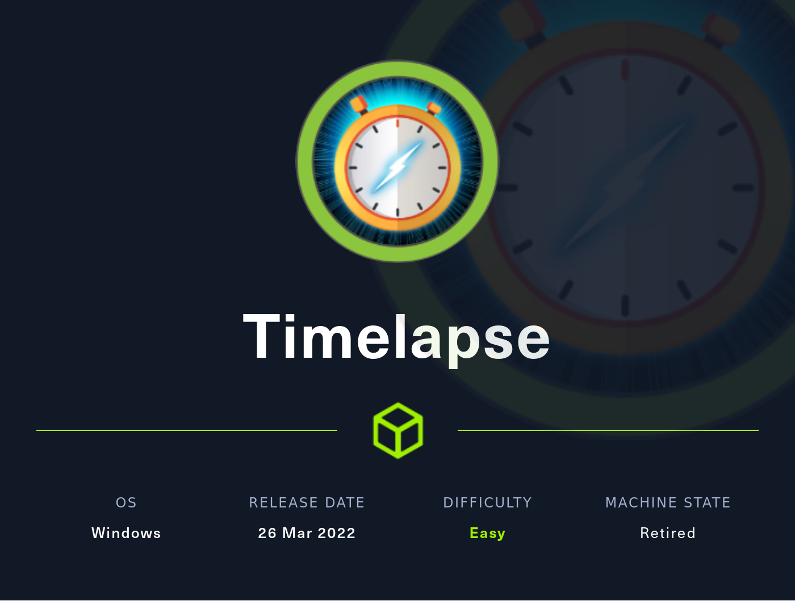

# Writeup for HackTheBox Retired Machine "Timelapse"

## Box Summary

Timelapse is an "easy" rated Windows machine which involved finding a pfx certificate in backup folder on an SMB share via anonymous access. Extracting hashes from the certificate and brute forcing gave us access to a win-rm session as user legacyy. This box is an excellent resource for learning how to pentest Micosoft Local Administrator Password Solution (LAPS). Via user legacyy's powershell history, we are able to create a PSCredential which allows us to authenticate and invoke commands as service account svc_deploy, who has access to dump the LAPS password. Dumping the pasword leads us to administrator access.

## Link to Writeup

[Full Timelapse Writeup](https://github.com/0xColonelPanic/HTB_Timelapse/blob/main/writeup.md)